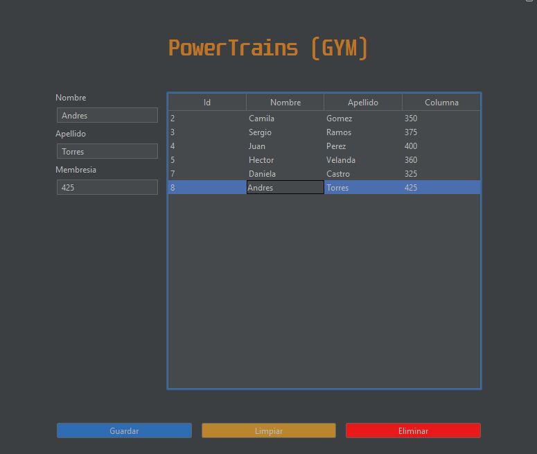

# 🏋️ App Gestión de Clientes – Gimnasio
**Java Swing · Spring · JUnit · Docker (en progreso)**

Aplicación de escritorio desarrollada en **Java** para la gestión básica de clientes de un gimnasio.  
Permite registrar, visualizar y eliminar clientes mediante una interfaz gráfica construida con **Swing**, siguiendo una arquitectura organizada y preparada para pruebas y contenedorización.

---

## 📸 Vista previa

---

## 🚀 Funcionalidades actuales

- 📋 Listado de clientes en una tabla
- ➕ Registro de nuevos clientes
- 🗑️ Eliminación de clientes
- 🧹 Limpieza de campos del formulario
- 🆔 Gestión de datos básicos:
    - Nombre
    - Apellido
    - Membresía

---

## 🧱 Tecnologías utilizadas

- **Java**
- **Java Swing** – Interfaz gráfica
- **Spring Framework** – Organización y gestión de componentes
- **JUnit** – (estructura preparada, pruebas en desarrollo)
- **Docker** – (pendiente de implementación)

---

## 📂 Estructura del# 🏋️ App Gestión de Clientes – Gimnasio
**Java Swing · Spring · JUnit · Docker (en progreso)**

Aplicación de escritorio desarrollada en **Java** para la gestión básica de clientes de un gimnasio.  
Permite registrar, visualizar y eliminar clientes mediante una interfaz gráfica construida con **Swing**, siguiendo una arquitectura organizada y preparada para pruebas y contenedorización.

---

## 📸 Vista previa

> Imagen ubicada en la carpeta `img/`

---

## 🚀 Funcionalidades actuales

- 📋 Listado de clientes en una tabla
- ➕ Registro de nuevos clientes
- 🗑️ Eliminación de clientes
- 🧹 Limpieza de campos del formulario
- 🆔 Gestión de datos básicos:
    - Nombre
    - Apellido
    - Membresía

---

## 🧱 Tecnologías utilizadas

- **Java**
- **Java Swing** – Interfaz gráfica
- **Spring Framework** – Organización y gestión de componentes
- **JUnit** – (estructura preparada, pruebas en desarrollo)
- **Docker** – (pendiente de implementación)

---

## 📂 Estructura del proyecto (resumen)

    App-Gestion-de-Clientes-Gimnasio-Swing-Spring-JUnit-Docker-
    │
    ├── src/
    │   ├── main/
    │   │   ├── java/
    │   │   │   ├── ui/          # Interfaz gráfica (Swing)
    │   │   │   ├── service/     # Lógica de negocio
    │   │   │   ├── model/       # Entidades
    │   │   │   └── config/      # Configuración Spring
    │   │   └── resources/
    │   └── test/
    │       └── java/            # Pruebas unitarias
    │
    ├── img/
    │   └── app.png
    │
    ├── README.md
    └── Dockerfile
    

## ▶️ Cómo ejecutar el proyecto

### 🔧 Requisitos

- Java JDK 17 o compatible  
- Maven  

### ▶️ Ejecución

    mvn clean install
    mvn exec:java

También puedes ejecutar la **clase principal** directamente desde tu 
IDE (IntelliJ IDEA, Eclipse o VS Code).

## 🧪 Pruebas

El proyecto cuenta con **pruebas unitarias implementadas usando JUnit**, enfocadas en validar la lógica de negocio y el correcto funcionamiento de los servicios principales.

Las pruebas se ejecutan automáticamente durante el ciclo de construcción con Maven.

### ▶️ Ejecutar pruebas

    mvn test

Las clases de prueba se encuentran en:

    src/test/java

## 🐳 Docker

La aplicación puede ejecutarse dentro de un contenedor Docker,
lo que facilita su despliegue y portabilidad entre entornos.

### ▶️ Construir la imagen

    docker build -t app-gimnasio .

